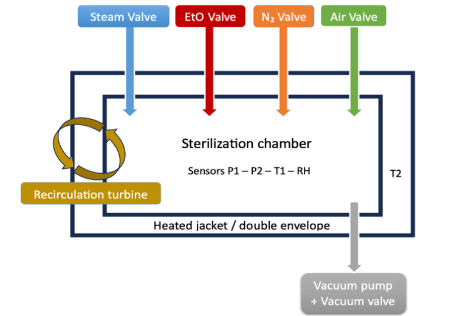
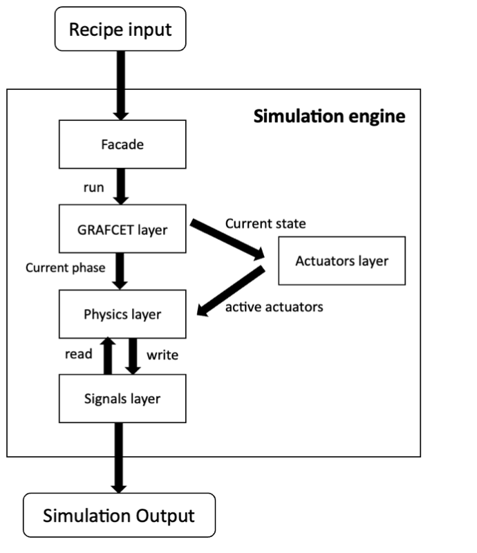

# Digital twin of an ethylene oxide (EtO) sterilizer

🇫🇷 [Version française](README.md)

> Final-year engineering project — Biomedical Engineering
> Defended on 22 June 2026.

A desktop application (Python / PySide6) that **simulates an EtO sterilization cycle** from its recipe,
then **compares it with a real cycle** taken from the machine's PDF report.
The simulator is a *grey-box* model (simplified physics + empirical coefficients) whose
coefficients are identified by least squares on real cycles.

<p align="center">
  
</p>

---

## 1. The problem

EtO sterilization is used for heat-sensitive medical devices (< 60 °C). EtO is
**flammable and carcinogenic**: pressure, temperature and humidity must be kept under control throughout every cycle.
To detect a machine drift, a **reference of the expected behavior** is needed — but the cycle history
of a newly installed sterilizer is too short to train a *data-driven* model.

**Chosen solution:** a grey-box digital twin, structured by the cycle logic (GRAFCET) and calibrated
on only a few real cycles.

| Approach | Verdict |
|---|---|
| Full physical model | Too complex for a multiphase process |
| Data-driven model | Unsuitable: too few cycles available |
| **Grey-box** | Process knowledge + simplified equations + adjustable coefficients ✔ |

## 2. How the application works

From the home page, three workflows are available:

1. **Simulate a cycle** — enter (or load from the database) a recipe: pressure setpoints, vacuum/injection
   rates, durations, target humidity, etc., phase by phase. The application produces simulated curves for
   **PT111, PT112 (pressures), TT111, TT112, TT191 (temperatures), RHT121 (relative humidity), GT121 (EtO mass)**
   and can export a PDF report.
2. **Analyze a real cycle** — import the machine's PDF report (extractor `eto_pdf_extractor.py`),
   overlay simulated and real curves after time alignment, get a per-phase deviation table, and automatically
   generated **RMSE, MAE and bias** metrics (comparison on PT111, TT112, RHT121).
3. **Calibrate the model** — fit the empirical coefficients on one or more real cycles;
   cycles not used for fitting serve as **validation**. Each calibration is a versioned snapshot,
   with rollback possible ([details](app/calibration/README.md), in French).

A **built-in guide** explains each phase of the cycle and the recipe parameters.

```
Recipe ──► Simulation engine ──► Simulated cycle ──┐
                                                   ├──► Comparison (RMSE / MAE / bias) ──► PDF report
Machine PDF ──► Extractor ──► Real cycle ──────────┘
                     ▲
     Calibration (least squares) ◄── real cycles
```

## 3. How the digital twin was designed

### Studied system

The chamber is wrapped in a heated double envelope. A vacuum pump, valves for steam, EtO, nitrogen and air,
and a recirculation turbine drive the cycle. The sensors track chamber pressure (P1, P2), chamber temperature (T1),
envelope temperature (T2) and relative humidity (RH).

<p align="center">
  
</p>

### Layered simulation engine (`app/model/`)

The engine separates the cycle logic, the actuator state and the physical computation:

<p align="center">
  
</p>

| Layer | File | Role |
|---|---|---|
| Facade | `sterilization_model.py` | Entry point: recipe → simulated segments |
| GRAFCET | `grafcet.py` | State machine: determines the active phase and chains the steps |
| Actuators | `actuators.py` | State of the valves (steam, EtO, N₂, air) and the vacuum pump for each step |
| Physics | `physics.py` | Equations for the evolution of pressure, temperature and humidity |
| Signals | `signals.py` | Variable values and coefficients ("factory" baseline, never modified) |

The engine is **independent of Qt**: it can be used in a script or a notebook.

### GRAFCET sequencing

The cycle is described as a sequence of steps, each with its actuators and its transition condition
(usually a pressure or humidity threshold, or a duration):

`Initial vacuum → Leak tests → Nitrogen dilution → Conditioning / humidification → EtO injection → Exposure → Pre-rinse vacuum → N₂ / air rinses → Final vacuum break`

### Physical layer (grey-box)

Each quantity follows a simplified equation with empirical coefficients. For example, the chamber temperature
depends on the exchange with the double envelope, the injections, the pressure variation and the losses:

```
dT111/dt = K_wall·(T112 − T111) + K_steam·s − K_gas·g + K_press·dP/dt − K_loss·(T111 − T112)
```

Pressure is driven by the recipe setpoints; temperature and humidity are computed.

### Least-squares calibration (`app/calibration/`)

The coefficients are identified by minimizing the gap between simulated and real curves
(`scipy.optimize.least_squares`, TRF method, with physical bounds):

```
θ̂ = argmin_θ  Σ_i ( y_sim,i(θ) − y_real,i )²
```

Workflow: real cycles + recipes → simulation with initial coefficients → gap computation → adjustment.

### Validation

The model is evaluated on cycles **not used for identification**: phase sequencing,
main parameter levels, dynamic trends.

<p align="center">
  
</p>

Results on a real validation cycle (metrics computed by the application):

| Variable | RMSE | MAE | Bias |
|---|---|---|---|
| TT111 (°C) | 1.924 | 1.489 | −1.355 |
| TT112 (°C) | 2.394 | 2.029 | −0.664 |
| RHT121 (%RH) | 6.863 | 5.046 | −2.976 |
| Cycle duration | — | — | +1.2 % |

The model reproduces the sequence of pressure phases, a consistent temperature dynamic and the
overall humidity trends. This is consistent with the goal: to serve as a **reference** for detecting
deviations, not to reproduce every single measurement point.

## 4. Code organization

```
main.py                     Entry point (loads the active calibration, starts the UI)
eto_pdf_extractor.py        Data extraction from a machine PDF report
app/
├── model/                  Simulation engine (GRAFCET, actuators, physics, signals) — no Qt
├── calibration/            Least-squares calibration + versioned snapshots
├── analysis/               Simulated/real comparison: time alignment, phase mapping, thresholds
├── ui/                     PySide6 pages (home, simulation, analysis, calibration)
├── database/               MySQL access to recipes
├── guide/                  Interactive guide to phases and parameters
└── utils/pdf_report.py     PDF report export (ReportLab)
config/                     Comparison thresholds, phase mapping
data/                       Calibration snapshots (JSON)
database/schema.sql         MySQL schema for recipes
```

## 5. Tech stack

Python · PySide6 (interface) · NumPy / SciPy (simulation and calibration) · Matplotlib (plots) · pdfplumber (machine report parsing) · ReportLab (PDF reports) · MySQL (recipes) · PyInstaller (standalone macOS application).

This repository is meant to **showcase** the digital twin. The recipes and the real cycle reports, which belong to the manufacturer, are deliberately not published. An example of a **simulated** cycle report is provided in [`examples/`](examples/).

## 6. Limitations and outlook

- Calibrations were performed on a limited number of cycles: the model is a starting point to be enriched
  as the machine's history builds up.
- The comparison is currently limited to PT111, TT112 and RHT121; TT111, TT191 and GT121 are simulated but not
  yet validated on real reports.
- Outlook: automatic deviation analysis to detect and anticipate machine drifts.

## Publication (in progress)

Related article: *Development of a modular multi-layer digital twin for ethylene oxide sterilization systems based on physical and empirical modeling*.

## Author

**Marouan Nejjar** — biomedical engineering student, ENSAM Rabat.
