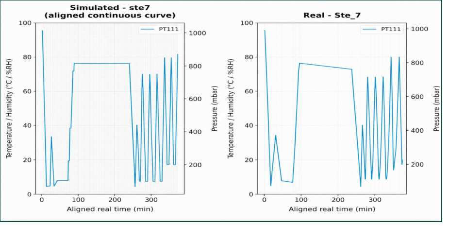
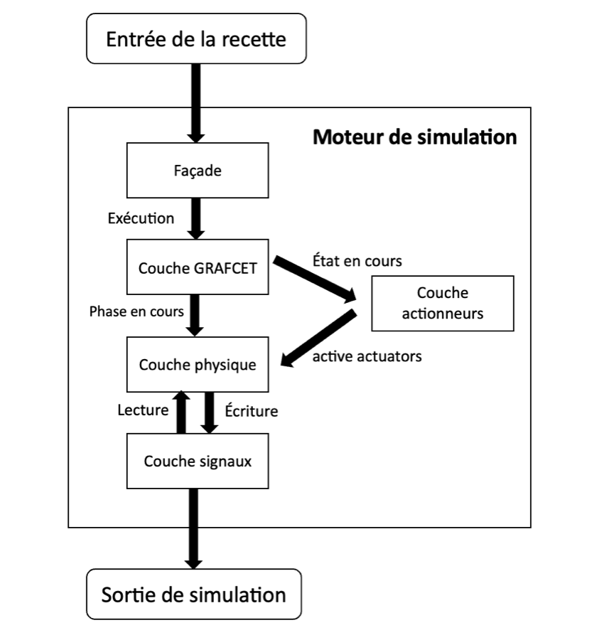
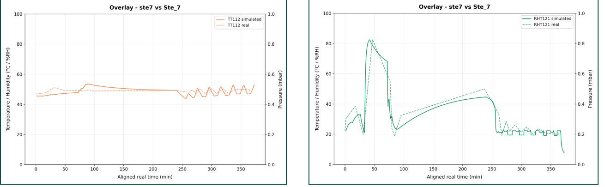

# Jumeau numérique d'un stérilisateur à l'oxyde d'éthylène (EtO)

> Projet de fin d'études — Génie Biomédical
> Soutenu le 22 juin 2026.

Application de bureau (Python / PySide6) qui **simule un cycle de stérilisation EtO** à partir de sa recette,
puis **le compare à un cycle réel** issu du rapport PDF de la machine.
Le simulateur est un modèle *grey-box* (physique simplifiée + coefficients empiriques) dont les
coefficients sont identifiés par moindres carrés sur des cycles réels.

*English summary: a modular digital twin of an industrial ethylene-oxide sterilizer — GRAFCET state machine +
grey-box physical model (pressure, temperature, humidity), least-squares calibration on real cycles,
and simulated-vs-real comparison with RMSE / MAE / bias metrics.*

<p align="center">
  
</p>

---

## 1. Le problème

La stérilisation à l'EtO sert aux dispositifs médicaux sensibles à la chaleur (< 60 °C). L'EtO est
**inflammable et cancérogène** : pression, température et humidité doivent être maîtrisées à chaque cycle.
Pour détecter une dérive de la machine, il faut une **référence du comportement attendu** — mais l'historique
de cycles d'un stérilisateur neuf est trop court pour entraîner un modèle *data-driven*.

**Solution retenue :** un jumeau numérique grey-box, structuré par la logique du cycle (GRAFCET) et calibré
sur quelques cycles réels seulement.

| Approche | Verdict |
|---|---|
| Modèle physique complet | Trop complexe pour un procédé multiphasique |
| Modèle data-driven | Inadapté : trop peu de cycles disponibles |
| **Grey-box** | Connaissance du procédé + équations simplifiées + coefficients ajustables ✔ |

## 2. Comment fonctionne l'application

Depuis la page d'accueil, on accède à trois parcours :

1. **Simuler un cycle** — on saisit (ou charge depuis la base) une recette : consignes de pression, vitesses de
   vide/injection, durées, humidité cible, etc., phase par phase. L'application produit les courbes simulées de
   **PT111, PT112 (pressions), TT111, TT112, TT191 (températures), RHT121 (humidité relative), GT121 (masse d'EtO)**
   et peut exporter un rapport PDF.
2. **Analyser un cycle réel** — import du rapport PDF de la machine (extracteur `eto_pdf_extractor.py`),
   superposition simulé / réel après alignement temporel, tableau d'écarts par phase, et métriques
   **RMSE, MAE, biais** générées automatiquement (comparaison sur PT111, TT112, RHT121).
3. **Calibrer le modèle** — ajustement des coefficients empiriques sur un ou plusieurs cycles réels ;
   les cycles non utilisés servent de **validation**. Chaque calibration est un instantané versionné,
   avec retour arrière possible ([détails](app/calibration/README.md)).

Un **guide intégré** explique chaque phase du cycle et les paramètres de la recette.

```
Recette ──► Moteur de simulation ──► Cycle simulé ──┐
                                                    ├──► Comparaison (RMSE / MAE / biais) ──► Rapport PDF
PDF machine ──► Extracteur ──► Cycle réel ──────────┘
                     ▲
     Calibration (moindres carrés) ◄── cycles réels
```

## 3. Comment le jumeau numérique a été conçu

### Moteur de simulation en couches (`app/model/`)

Le moteur sépare la logique du cycle, l'état des actionneurs et le calcul physique :

<p align="center">
  
</p>

| Couche | Fichier | Rôle |
|---|---|---|
| Façade | `sterilization_model.py` | Point d'entrée : recette → segments simulés |
| GRAFCET | `grafcet.py` | Machine à états : détermine la phase active et enchaîne les étapes |
| Actionneurs | `actuators.py` | État des vannes (vapeur, EtO, N₂, air) et de la pompe à vide selon l'étape |
| Physique | `physics.py` | Équations d'évolution de la pression, de la température et de l'humidité |
| Signaux | `signals.py` | Valeurs des variables et coefficients (socle « usine », jamais modifié) |

Le moteur est **indépendant de Qt** : il peut être utilisé dans un script ou un notebook.

### Séquencement GRAFCET

Le cycle est décrit comme une suite d'étapes, chacune avec ses actionneurs et sa condition de transition
(souvent un seuil de pression ou d'humidité, ou une durée) :

`Vide initial → Tests de fuite → Dilution azote → Conditionnement / humidification → Injection EtO → Exposition → Vide avant rinçage → Rinçages N₂ / air → Casse-vide finale`

### Couche physique (grey-box)

Chaque grandeur suit une équation simplifiée avec des coefficients empiriques. Par exemple, la température de
la chambre dépend des échanges avec la double enveloppe, des injections, de la variation de pression et des pertes :

```
dT111/dt = K_wall·(T112 − T111) + K_steam·s − K_gas·g + K_press·dP/dt − K_loss·(T111 − T112)
```

La pression est pilotée par les consignes de la recette ; la température et l'humidité sont calculées.

### Calibration par moindres carrés (`app/calibration/`)

Les coefficients sont identifiés en minimisant l'écart entre courbes simulées et courbes réelles
(`scipy.optimize.least_squares`, méthode TRF, avec bornes physiques) :

```
θ̂ = argmin_θ  Σ_i ( y_sim,i(θ) − y_réel,i )²
```

Workflow : cycles réels + recettes → simulation avec coefficients initiaux → calcul des écarts → ajustement.

### Validation

Le modèle est évalué sur des cycles **non utilisés pour l'identification** : enchaînement des phases,
niveaux principaux des paramètres, tendances dynamiques.

<p align="center">
  
</p>

Résultats sur un cycle réel de validation (métriques calculées par l'application) :

| Variable | RMSE | MAE | Biais |
|---|---|---|---|
| TT111 (°C) | 1.924 | 1.489 | −1.355 |
| TT112 (°C) | 2.394 | 2.029 | −0.664 |
| RHT121 (%RH) | 6.863 | 5.046 | −2.976 |
| Durée du cycle | — | — | +1.2 % |

Le modèle reproduit l'enchaînement des phases de pression, une dynamique de température cohérente et les
tendances globales d'humidité. Résultat cohérent avec l'objectif : servir de **référence** pour détecter
les écarts, pas de reproduire chaque point de mesure.

## 4. Organisation du code

```
main.py                     Point d'entrée (charge la calibration active, lance l'UI)
eto_pdf_extractor.py        Extraction des données d'un rapport PDF machine
app/
├── model/                  Moteur de simulation (GRAFCET, actionneurs, physique, signaux) — sans Qt
├── calibration/            Calibration moindres carrés + instantanés versionnés
├── analysis/               Comparaison simulé/réel : alignement temporel, mapping de phases, seuils
├── ui/                     Pages PySide6 (accueil, simulation, analyse, calibration)
├── database/               Accès MySQL aux recettes
├── guide/                  Guide interactif des phases et paramètres
└── utils/pdf_report.py     Export du rapport PDF (ReportLab)
config/                     Seuils de comparaison, mapping de phases
data/                       Instantanés de calibration (JSON)
database/schema.sql         Schéma MySQL des recettes
```

## 5. Stack technique

Python · PySide6 (interface) · NumPy / SciPy (simulation et calibration) · Matplotlib (courbes) · pdfplumber (lecture des rapports machine) · ReportLab (rapports PDF) · MySQL (recettes) · PyInstaller (application macOS autonome).

Ce dépôt a vocation à **présenter** le jumeau numérique. Les recettes et les rapports de cycles réels, propres à l'industriel, n'y sont volontairement pas publiés. Un exemple de rapport de cycle **simulé** est fourni dans [`examples/`](examples/).

## 6. Limites et perspectives

- Calibrations réalisées sur un nombre restreint de cycles : le modèle est un point de départ à enrichir
  au fur et à mesure que l'historique de la machine se construit.
- Comparaison actuellement limitée à PT111, TT112 et RHT121 ; TT111, TT191 et GT121 sont simulées mais pas
  encore validées sur les rapports réels.
- Perspective : analyse automatique des écarts pour détecter et anticiper les dérives de la machine.

## Publication

Article associé : *Development of a modular multi-layer digital twin for ethylene oxide sterilization systems based on physical and empirical modeling* (IAPGOŚ, 2026).

## Auteur

**Marouan Nejjar** — élève-ingénieur en Génie Biomédical, ENSAM Rabat.
